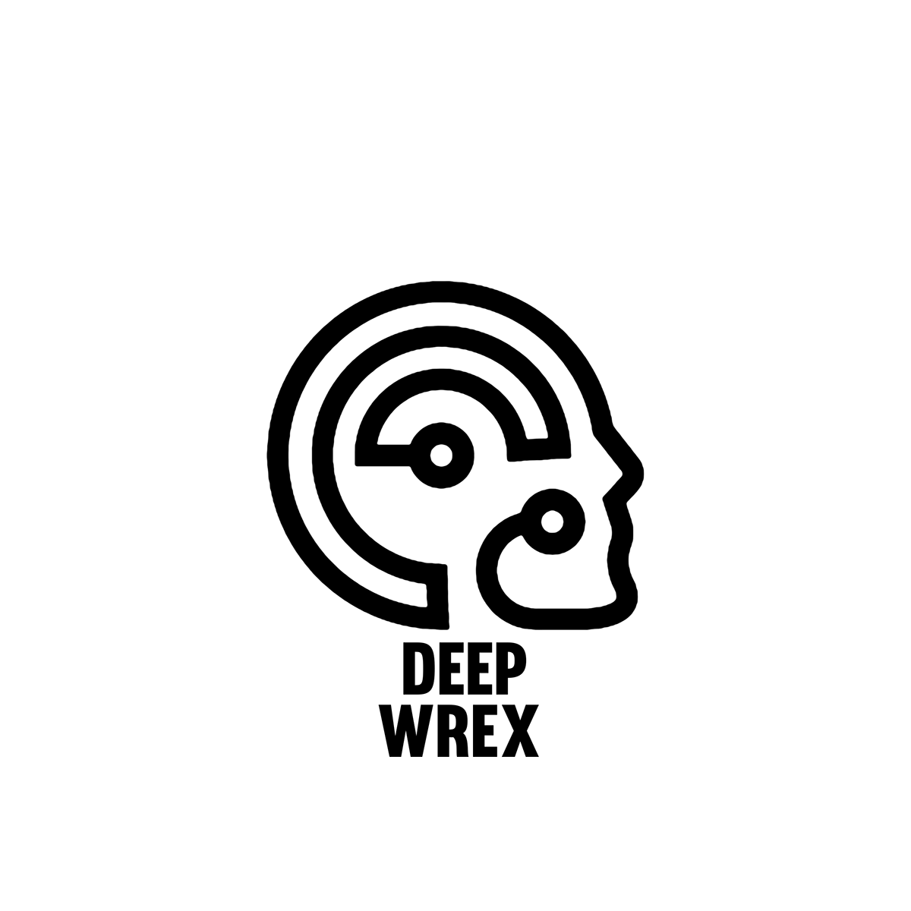
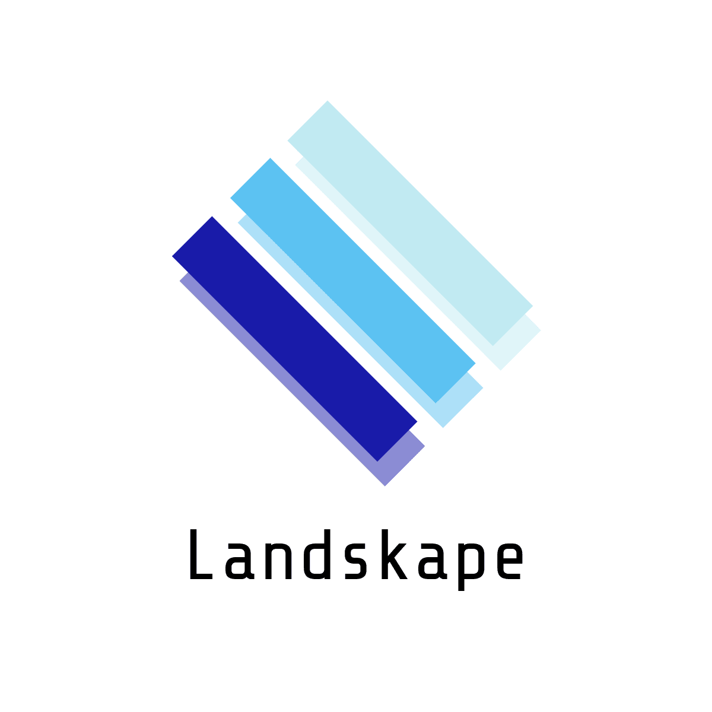
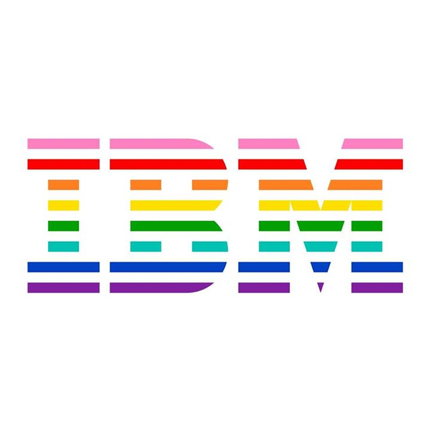
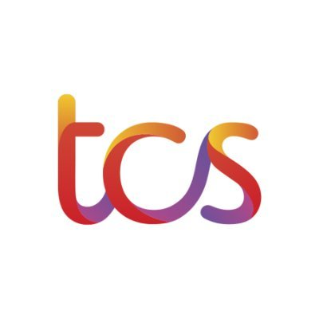

# Echo Docs

Welcome to the documentation for [Echo](https://github.com/digantamisra98/Echo). \(_**Under Construction**_\)



Echo is a python package containing novel, validated methods and layers employed in deep neural networks which are not natively available in popular libraries like [PyTorch](https://pytorch.org/), [MegEngine ](https://megengine.org.cn/)and [TensorFlow](https://www.tensorflow.org/).

> Let your neural network Echo!



Our goal with Echo is to provide a single, easy to use, well documented package which contains all the novel methods proposed in deep learning without the hassle of you to write it's code. With our support of PyTorch, MegEngine and TensorFlow, we want to ensure that you spend more time experimenting new modules rather than coding them from scratch. 



Echo started as a passionate idea by two individuals:

* [Diganta Misra](https://digantamisra98.github.io/)
* [Alexandra Deis](https://lexie88rus.github.io/)

It was further enhanced and supported by:

* [Sasikanth Kotti](https://github.com/ksasi)
* [Soumik Rakshit](https://soumik12345.github.io/)



Echo is a community driven and supported project. We highly encourage researchers, practitioners and OSS enthusiasts to contribute to Echo. 

Please check out our [contributing guidelines](https://xa9ax.gitbook.io/echo/contributing-guidelines) before submitting a pull request or raising an issue.

Thanks!




Echo is maintained and supported by passionate researchers and developers from diverse backgrounds and diverse organizations. The project is built on the commitment of providing universal platform supported deep learning modules for fast research and experimentation.


_To get your organization logo displayed here, please contact any of the package admins/ creators._


|   |   |    |   |   |    |
| :---: | :---: | :---: | :--- | :--- | :---: |



Check out the project roadmap [here](https://github.com/digantamisra98/Echo/projects).

