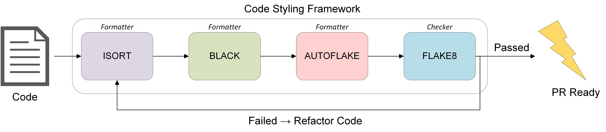

# Contributing Guidelines

## Introduction

This page contains all relevant information for individuals and institutions who intend to contribute to Echo. Echo is an open source project and, as such, its success relies on its community of contributors willing to keep improving it. We value every contribution highly and believe a foundation guideline is extremely crucial in maintaining the quality of the code in such open source packages. 

Thus, we request you to read this page thoroughly before initiating your contribution, irrespective of whether you're a seasoned open source contributor/ maintainer or a first time contributor. 

Thanks! 

## Issues

We highly encourage to raise issues before submitting a pull request regarding a new feature request. This helps us to communicate with you in regards to the validation and feasibility of introducing the new feature in discussion to Echo. As the scope of the project is huge, we plan to add new features which either has been published or has been validated by community usage. _**The discretion of accepting/ rejecting new feature requests lies solely with the administrators of the branch and the lead maintainers of the package.**_ 

We also encourage to raise an issue regarding faulty code, vulnerabilities or bugs before submitting a pull request so that we can efficiently address the severity of the bug in question and also communicate efficient fix for you to submit ideal pull requests to resolve them. Please follow the issues template for consistency. 

## Pull Requests

We encourage you to create pull requests early. It helps us track the contributions under development, whether they are ready to be merged or not. Change your pull request's title to begin with `[WIP]` until it is ready for formal review.

_Please follow the default pull request template generated while creating a new pull request_.

This section highlights all the necessary preparation steps required before sending a pull request. To collaborate efficiently, please read through this section and follow them.

### Code Style



Echo relies on [Black ](https://github.com/psf/black)and [Flake8 ](https://github.com/PyCQA/flake8)for code formatting and style checking. We additionally use [isort ](https://pycqa.github.io/isort/)for sorting and grouping `import` statements in code and [autoflake ](https://github.com/myint/autoflake)for removing unused `imports` and unused `variables`. Before submitting a pull request, we recommend that all linting should pass, by running the following command locally:

```text
pip install -U -r requirements.txt  # install the dependencies
make lint  # runs the linting tools only
```

### Vulnerabilities Tracking

|   | Echo relies on Snyk for tracking vulnerability issues involved with dependencies graph for Echo. Snyk test is directly incorporated into the Travis CI/CD pipeline.    |
| :---: | :--- |


### Tests

Echo enforces four types of test to maintain code standards and compatibility for stable releases across platforms. These four types include:

* **Smoke Tests**
* **Break Tests**
* **Unit Tests**
* **Integration Tests**

All tests for Echo is located under the `tests/` directory. 

Before submitting a pull request, we recommend that all tests should pass, by running the following command locally:

```text
pip install -U -r requirements.txt  # install the dependencies
make test # runs all tests
```

It is recommended that the new test `test_[module_name].py` is constructed by using only python 3.6+ build-in functions, `torch`, `numpy`, and `parameterized` packages. If it requires any other external packages, please make sure:

* the packages are listed in `requirements.txt`
* the packages don't have any vulnerabilities by running it locally against Snyk.

_If it's not tested, it's broken_

All new functionality should be accompanied by an appropriate set of tests. Echo functionality has plenty of unit tests from which you can draw inspiration, and you can reach out to us if you are unsure of how to proceed with testing.

### Modularity

To avoid code replication, we maintain common utils files in the `utils/`. It's highly encouraged to keep the code modular and keep common functionalities in utils files.

### Documentation

Echo's docs are located in the `master` branch of [Echo Docs](https://github.com/digantamisra98/Echo-Docs). 

While adding any new functionalities or fixing bug in Echo which requires modification in it's corresponding documentation, submit a pull request to the docs repository with clear reference to the original ticket in the Echo repository. Please follow the markdown styling for documentation as maintained in Echo Docs. 
