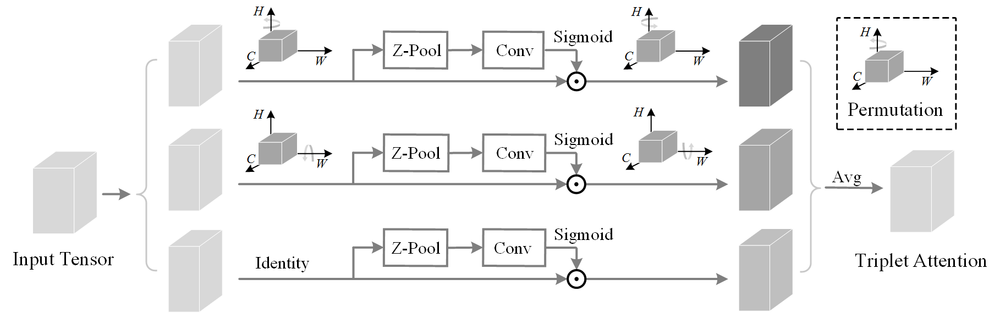
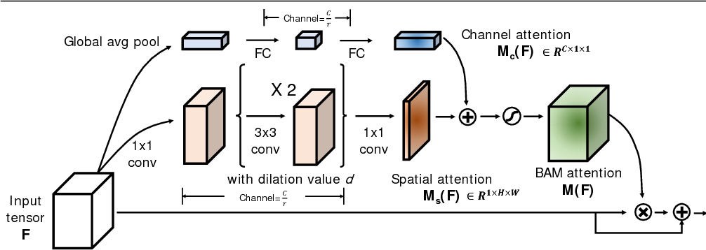

# PyTorch

## Triplet Attention

```python
echoAI.Attention.cv.t_attn.TripletAttention(no_spatial = False, kernel_size = 7)
```



#### Parameters: <a id="triplet-parameters"></a>

* **no\_spatial** - switches on the spatial attention branch in Triplet Attention. Default: `False`
* **kernel\_size** - window size of the convolution filters in Triplet Attention. Default: 7

#### Shape: <a id="triplet-shape"></a>

* Input:$$(\mathbf{N}, \mathbf{C}, \mathbf{H}, \mathbf{W})$$4 dimensional feature map tensor.
* Output:$$(\mathbf{N}, \mathbf{C}, \mathbf{H}, \mathbf{W})$$,same shape as input

#### Reference: <a id="triplet-reference"></a>

[Rotate to Attend: Convolutional Triplet Attention Module](https://arxiv.org/abs/2010.03045)

## Squeeze Excite Attention

```python
echoAI.Attention.cv.t_attn.SE(gate_channels, reduction_ratio = 16)
```


#### Parameters: <a id="se-parameters"></a>

* **gate\_channels** - number of channels in the input tensor. Datatype: `Integer`
* **reduction\_ratio** - squeeze bottleneck factor of the MLP in Squeeze Excite Attention. Default: 16

#### Shape: <a id="se-shape"></a>

* Input:$$(\mathbf{N}, \mathbf{C}, \mathbf{H}, \mathbf{W})$$4 dimensional feature map tensor.
* Output:$$(\mathbf{N}, \mathbf{C}, \mathbf{H}, \mathbf{W})$$,same shape as input

#### Reference: <a id="se-reference"></a>

[Squeeze-and-Excitation Networks](https://arxiv.org/abs/1709.01507)

## Convolutional Block Attention Module 

```python
echoAI.Attention.cv.t_attn.CBAM(gate_channels, kernel_size = 3, reduction_ratio = 16, pool_types = ['avg', 'max'], no_spatial = False, bam = False, num_layers = 1, bn = False, dilation_conv_num = 2, dilation_val = 4)
```

 **Supports both Convolutional Block Attention Module \(CBAM\) and Bottleneck Attention Module \(CBAM\)**




#### Parameters: <a id="se-parameters"></a>

* **gate\_channels** - number of channels in the input tensor. Datatype: `Integer`
* **kernel\_size** - window size of the convolution filters in CBAM/ BAM. Default: 3
* **reduction\_ratio** - width factor of the MLP in CBAM/BAM. Default: 16
* **pool\_types** - `list`of global pooling operators for channel attention gate in CBAM/BAM. Default: `['avg', 'max']`. Note: This is the default for CBAM, which expects two operators, however, if BAM is switched on, pass `['avg']`. Available options: `avg`, `lp`, `max`
* **no\_spatial** - switches off the spatial attention gate in CBAM. Default: `False`
* **bam** - initializes BAM. Default: `False`
* **num\_layers** - controls the number of hidden layers in the MLP of channel attention gate in CBAM/BAM. Default: 1
* **bn** - adds a Batch Normalization layer in the MLP of the channel attention gate in CBAM/BAM. Default: `False`. Pass True when **bam** is `True`.
* **dilation\_conv\_num** - number of dilated channel preserving convolution layers in the spatial attention gate in BAM. Default: 2
* **dilation\_val** - dilation factor for the convolution layers in the spatial attention gate in BAM. Default: 4


Note: By default, CBAM is initialized.


#### Shape: <a id="cbam-shape"></a>

* Input:$$(\mathbf{N}, \mathbf{C}, \mathbf{H}, \mathbf{W})$$4 dimensional feature map tensor.
* Output:$$(\mathbf{N}, \mathbf{C}, \mathbf{H}, \mathbf{W})$$,same shape as input

#### References: <a id="cbam-references"></a>

[CBAM: Convolutional Block Attention Module](https://arxiv.org/abs/1807.06521)

[BAM: Bottleneck Attention Module](https://arxiv.org/abs/1807.06514)

